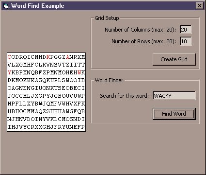



## How to Search a Grid of Characters to Find a Specific Word \(Like in Boggle\)

### Description

This code demonstrates how to search a grid of characters for a given word. Similar to the game Boggle.
 
### More Info
 

             |
---                |---
**Submitted On**   |2000-12-22 14:26:32
**By**             |[Daniel S\. Soper](https://github.com/Planet-Source-Code/PSCIndex/blob/master/ByAuthor/daniel-s-soper.md)
**Level**          |Intermediate
**User Rating**    |4.3 (13 globes from 3 users)
**Compatibility**  |VB 6\.0
**Category**       |[Miscellaneous](https://github.com/Planet-Source-Code/PSCIndex/blob/master/ByCategory/miscellaneous__1-1.md)
**World**          |[Visual Basic](https://github.com/Planet-Source-Code/PSCIndex/blob/master/ByWorld/visual-basic.md)
**Archive File**   |[CODE\_UPLOAD1295212222000\.zip](https://github.com/Planet-Source-Code/daniel-s-soper-how-to-search-a-grid-of-characters-to-find-a-specific-word-like-in-boggle__1-13798/archive/master.zip)

### API Declarations

TextOut

